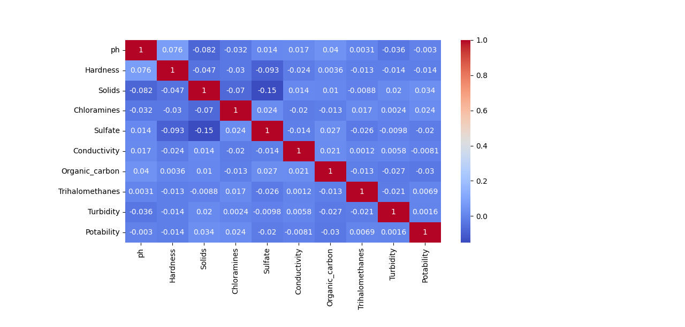
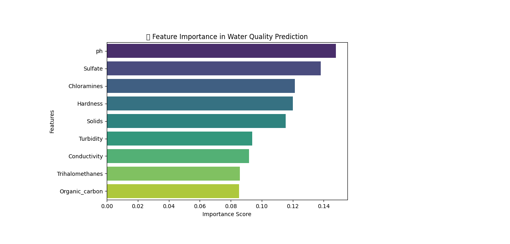

# 💧 Water Quality Prediction

This project predicts whether water is **safe for drinking** or **not safe** using machine learning.  
It includes a **training script** and a **Streamlit application** for interactive prediction.

---

## 📂 Project Structure
```
│── Datasets/                 # Contains dataset files used for training and testing
│── Figures/                  # Contains plots, graphs, and visualizations
│── Models/                   # Stores trained machine learning models and scaler files
│
│── train_model.py            # Script to train and evaluate ML models
│── app.py                    # Streamlit web application for predictions
└── README.md                 # Project documentation
```

---

## ⚙️ Files & Folders

### 1️⃣ `train_model.py`
- Loads the dataset from **Datasets/**
- Preprocesses data (missing values, scaling, etc.)
- Trains machine learning models
- Saves the trained model(s) into **Models/**

### 2️⃣ `app.py`
- Streamlit web app for user interaction
- Provides two modes:
  - **Manual Input** → Enter values to predict water quality  
  - **CSV Upload** → Upload dataset for batch predictions
- Displays prediction results and visualizations (from **Figures/**)

### 3️⃣ `Datasets/`
- Contains the dataset file(s) required for training and testing.  
  Example: `water_potability.csv`

### 4️⃣ `Figures/`
- Stores plots and visualizations generated during training & analysis.  
- Example files:
  - `Bar_plot.png`  
  - `Heatmap.png`  
  - `Feature_Importance.png`

📊 **Sample Visualizations**  
  
  



### 5️⃣ `Models/`
- Contains saved trained model(s) and preprocessing scaler(s).  
  Example: `water_quality_model.pkl`, `scaler.pkl`

---

## 🚀 Usage

### ▶️ Train Model
```bash
python train_model.py
```

### ▶️ Run Streamlit App
```bash
streamlit run app.py
```

---

## 👨‍💻 Author
**Sujal Tankaria**  

